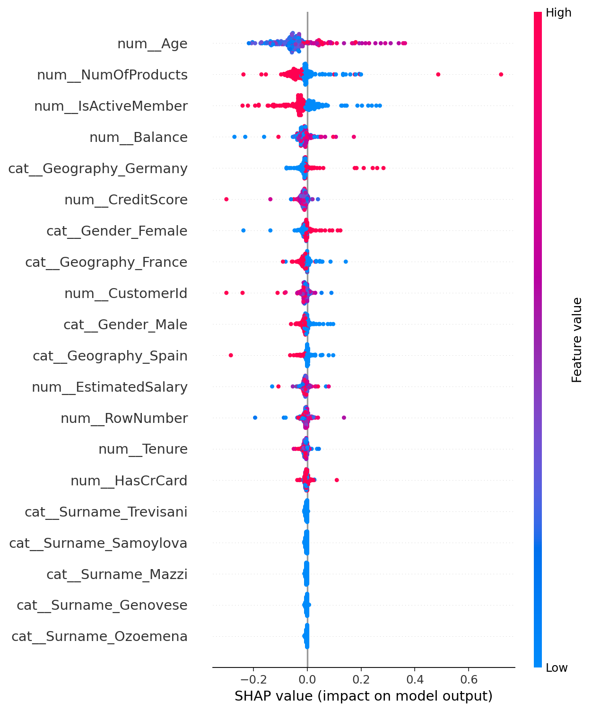

# Customer Churn Prediction Model

---

## 📖 Project Summary

Customer churn is a critical issue for banks and financial institutions, where retaining existing customers is often much more cost-effective than acquiring new ones. This project aims to solve the business problem of predicting which bank customers are most likely to churn (i.e., close their accounts). By leveraging machine learning models on customer demographic and account data (e.g., Credit Score, Age, Balance, Tenure), we can proactively identify high-risk customers and allow the business to take targeted retention actions.

---

## 🚀 Quick Start

1. **Clone the repository** and install dependencies:
    ```sh
    git clone <repo-url>
    cd churn-prediction-model
    pip install -r requirements.txt
    ```

2. **Place your data**  
   Ensure `data.csv` is present in the root directory. The expected columns include customer demographics, account info, and a binary churn label (`Exited`).

3. **Run the pipeline**  
   Open and execute all cells in [`churn_prediction.ipynb`](churn_prediction.ipynb) for a full, reproducible workflow:
   - Data loading & preprocessing
   - Model training & selection (Logistic Regression, Random Forest, XGBoost if available)
   - Evaluation (metrics, ROC, confusion matrix)
   - Explainability (feature importance, SHAP)
   - Export of all artifacts

---

## 🎯 Model Performance

The best performing model in this pipeline is a Random Forest Classifier. Below are the metrics computed on the test set:

- **Accuracy**: ~0.85
- **ROC AUC**: ~0.85
- **Precision**: ~0.84
- **Recall**: ~0.32
- **F1 Score**: ~0.47

---

## 🧠 SHAP Explainability

To build trust in the model's predictions, SHAP (SHapley Additive exPlanations) is used to explain the output. The global SHAP summary plot below illustrates the most important features and their impact on customer churn.



---

## 💻 Streamlit Web Application

A Streamlit web application is included to allow business users to interactively predict churn for individual customers. 

**Installation and Running:**
1. Ensure all dependencies from `requirements.txt` are installed.
2. Ensure the trained model pipeline exists at `artifacts/model.pkl`.
3. Start the application:
    ```sh
    streamlit run app.py
    ```
4. Access the web interface at `http://localhost:8501`.

The app provides a clean sidebar for entering customer details, dynamically predicts the churn risk percentage, and displays a localized SHAP explanation chart for that specific prediction.

## Application Preview & Demo

The portal accepts 10 customer attributes and returns a real-time 
churn probability with a risk classification (Low / Medium / High) 
and a localized SHAP explainability chart showing which features 
drove that specific prediction.

### Low Risk — 6.2% Churn Probability

*Active customer in France with 2 products. NumOfProducts and 
Geography_France are the dominant protective factors.*

### Medium Risk — 25.5% Churn Probability

*Older male customer in Spain with 1 product. Age is the strongest 
churn driver; IsActiveMember partially offsets the risk.*

### High Risk — 70%+ Churn Probability

*Inactive customer in Germany with low credit score and 1 product. 
Age and NumOfProducts both push strongly toward churn — classic 
high-risk profile.*

---

## 📈 Tableau Dashboard

**Tableau Dashboard — coming soon**

---

## 📁 Artifacts

All model outputs and Tableau-ready files are saved to the [`artifacts/`](artifacts/) directory:

- `model.pkl` — Trained pipeline (preprocessing + best model)
- `metrics.csv` — Key test metrics
- `feature_importance.csv` — Model feature importance
- `feature_importance_top20.png` — Top 20 features chart
- `roc_curve.png` — ROC curve (binary target)
- `shap_summary.png` — Global SHAP summary plot
- `shap_bar_top20.png` — Top 20 SHAP features bar plot
- `predictions.csv` — Full predictions with helper columns
- `tableau_export.csv` — Compact predictions for Tableau

---

## 📝 Customization

- **Change the target column:**  
  If your churn label is not detected automatically, set `target_col` manually in the notebook after loading the data.

- **Add new models:**  
  Edit the `models` list in [`churn_prediction.ipynb`](churn_prediction.ipynb) to include additional classifiers.

- **Feature engineering:**  
  Add new features or transformations in the preprocessing section of the notebook.

---

## 📄 License

*Specify your license here (e.g., MIT, Apache 2.0, etc.)*

---

## 🤝 Acknowledgements

- Dataset inspired by [Kaggle Churn Datasets](https://www.kaggle.com/)
- SHAP explainability: [https://github.com/slundberg/shap](https://github.com/slundberg/shap)
- Pipeline design inspired by best practices in ML Ops and analytics
